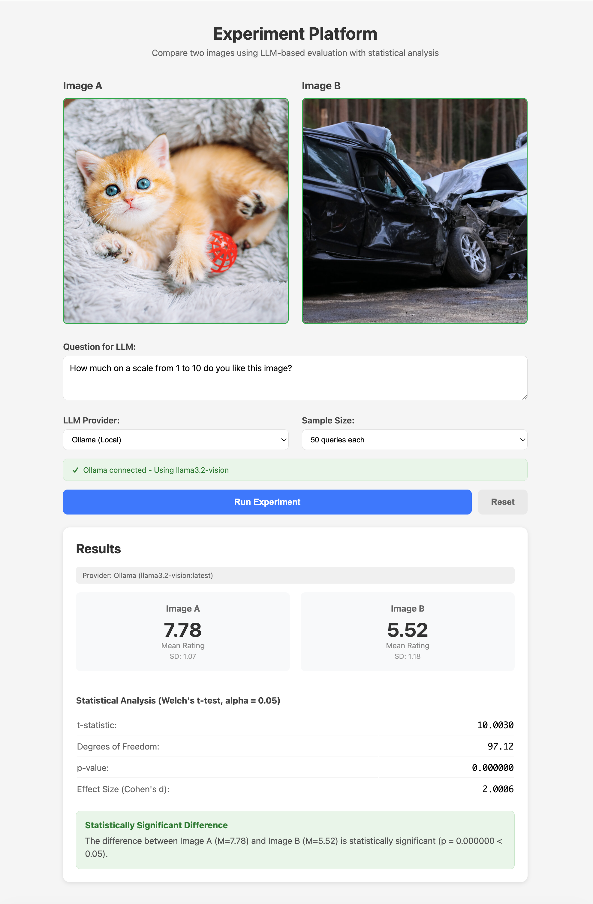

# Experiment Platform

A React-based A/B testing platform for comparing images using LLM-based evaluation with statistical analysis.



## Features

- **Image Comparison**: Upload two images side-by-side for comparison
- **LLM Evaluation**: Ask questions about images and get ratings (1-10 scale)
- **Multiple Providers**: Support for Mock (simulated) and Ollama (local LLM) providers
- **Statistical Analysis**: Welch's t-test with configurable sample sizes
- **Real-time Progress**: Track experiment progress with live updates

## Getting Started

### Prerequisites

- Node.js 18+
- (Optional) [Ollama](https://ollama.ai/) with a vision model for real LLM evaluation

### Installation

```bash
npm install
```

### Running the App

```bash
npm run dev
```

Open http://localhost:5173 in your browser.

### Using Ollama (Optional)

To use real LLM evaluation instead of mock responses:

1. Install Ollama from https://ollama.ai/
2. Pull a vision model:
   ```bash
   ollama pull llama3.2-vision
   ```
3. Start Ollama:
   ```bash
   ollama serve
   ```
4. Select "Ollama (Local)" from the provider dropdown in the app

## Usage

1. Upload two images by clicking or dragging into the upload areas
2. Enter a question (e.g., "How much on a scale from 1 to 10 do you like this image?")
3. Select your LLM provider (Mock or Ollama)
4. Choose sample size (10, 30, or 50 queries per image)
5. Click "Run Experiment"
6. View results including mean ratings, statistical analysis, and significance conclusion

## Statistical Analysis

The platform uses Welch's t-test (independent samples) with:
- Alpha level: 0.05 (5% significance)
- Effect size: Cohen's d
- No assumption of equal variances

## Project Structure

```
src/
├── App.jsx              # Main UI component
├── App.css              # Styles
├── hooks/
│   └── useExperiment.js # Experiment orchestration hook
└── services/
    ├── llm/
    │   ├── index.js     # LLM provider factory
    │   └── providers/
    │       ├── mock.js  # Mock provider
    │       └── ollama.js # Ollama provider
    └── statistics.js    # Statistical functions
```

## License

MIT
